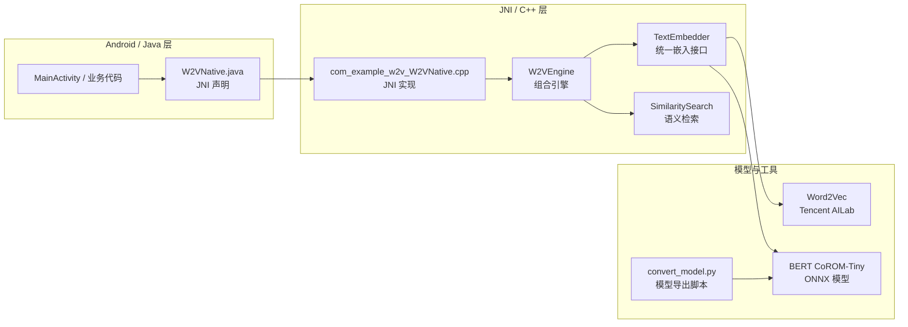
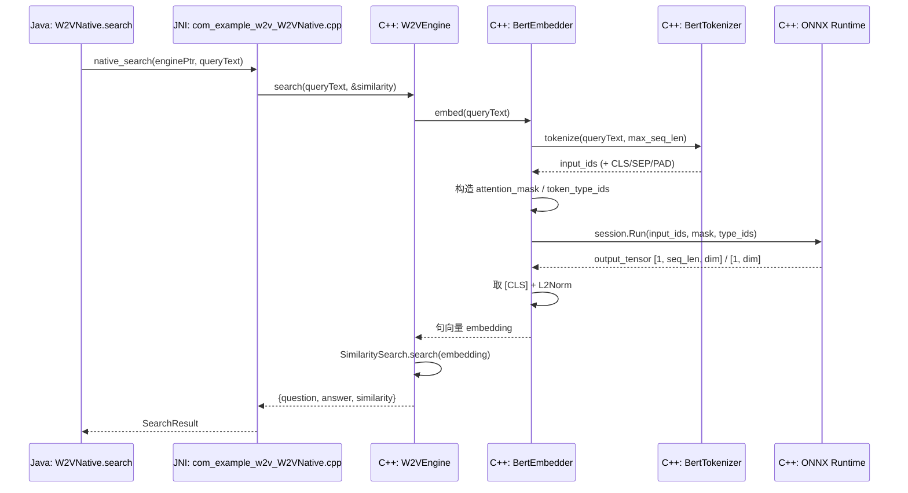
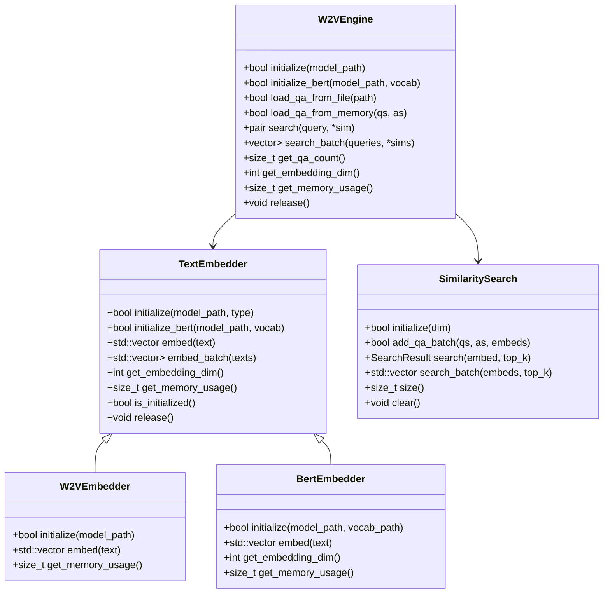
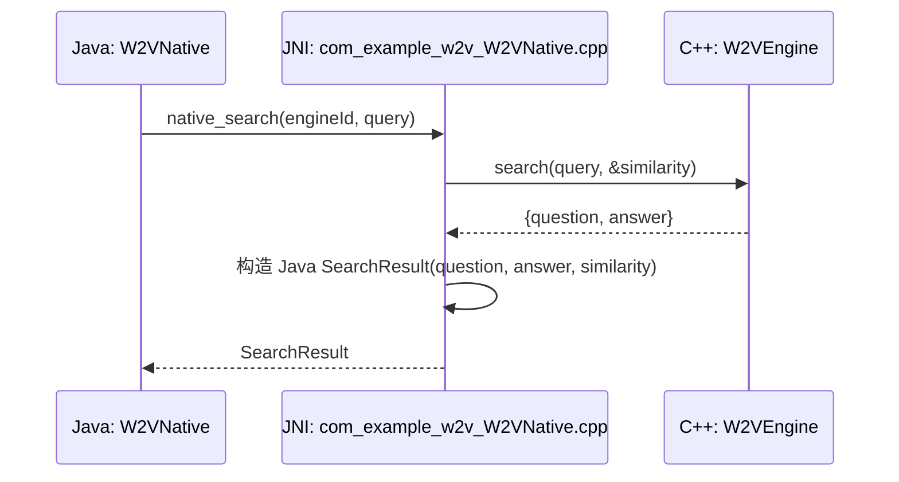
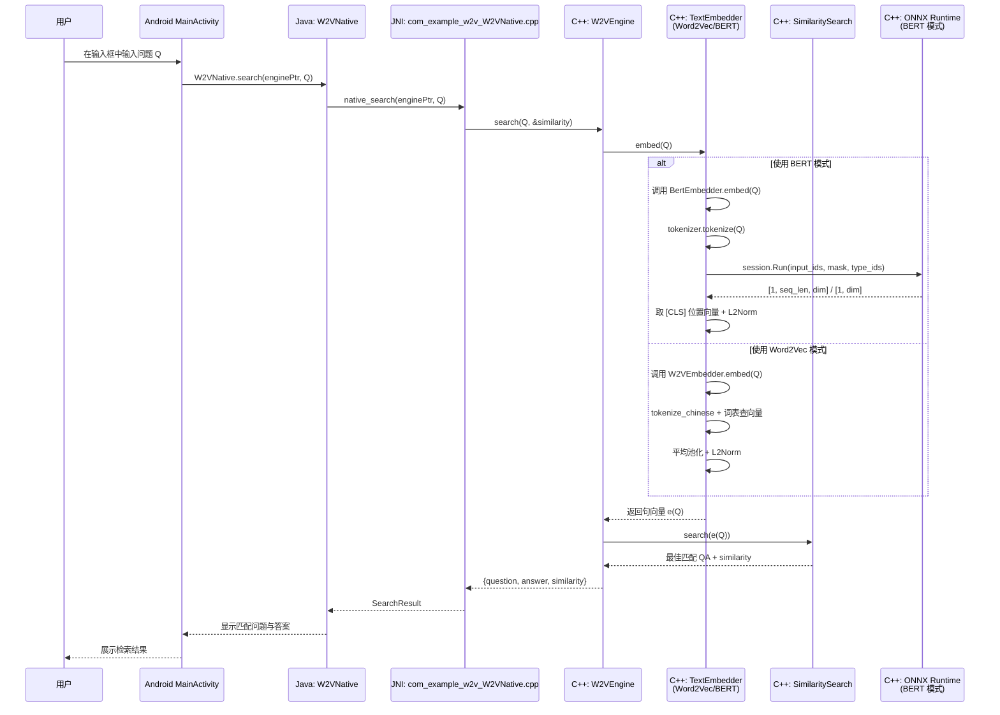

# FastW2V-JNI：从模型到移动端语义检索的完整落地实践

> 本文基于当前 FastW2V-JNI 仓库源码撰写，目标是从「为什么要做」到「如何实现」，系统性拆解一个 **支持 Word2Vec + BERT (ONNX Runtime) 的中文语义检索引擎**，并完整跑在 Android 端离线环境中。
>
> 文章内容将围绕：
>
> - 项目整体设计与目录结构
> - Word2Vec 与 BERT 两套引擎的对比与实现
> - ONNX Runtime 推理链路（以 CoROM-Tiny 为例）
> - 相似度检索引擎的实现（SimilaritySearch）
> - JNI 层与 Android 集成实践
> - 性能、内存与工程实践经验
>
> 同时结合：
>
> - 关键代码片段（带详细注释）
> - Mermaid 图（流程图、时序图、类图）
> - 结合原模型仓库中的结构图（如 ）
> - 多张总结性表格
>
> 方便你既能「看懂」，也能「照着改造自己项目」。

---

## 一、项目背景：为什么是 FastW2V-JNI？

在很多中文业务场景里，我们经常会遇到类似的需求：

- 手里有一堆 FAQ / QA 数据，希望用户提问时自动匹配最合适的一条；
- 场景在 App 内部，甚至在离线环境（如车机、嵌入式设备）中；
- 对隐私、安全有要求，希望**尽量在本地完成语义计算**；
- 设备算力有限，不能上来就塞一个巨大的大模型。

传统方案要么是：

- 后端部署大模型服务，App 通过 HTTP 调用：
  - 好处：模型能力强，易更新；
  - 缺点：依赖网络、延迟高、隐私风险、维护成本高。
- App 内部使用“关键词匹配 + if-else”：
  - 好处：简单直接；
  - 缺点：可维护性差，泛化能力极弱，稍微变换问法就匹配不到。

**FastW2V-JNI** 给出的答案是一条「工程化的中道」：

- 模型层使用**两套引擎**：
  - 传统 **Word2Vec**：利用大规模预训练词向量，快速且轻量；
  - 现代 **BERT (CoROM-Tiny)**：基于 Transformer 的中文句向量模型，语义表达更强；
- 底层核心逻辑使用 **C++17** 实现，性能可控；
- 通过 **JNI** 对外暴露统一接口，方便 Android / Java 项目集成；
- 使用 **ONNX Runtime** 在端侧执行 BERT 推理；
- 整套方案完全支持 **离线运行**，模型与数据都在本地。

一句话概括：

> **FastW2V-JNI 是一个“面向移动端的双引擎中文语义检索内核”，同时兼顾性能与语义能力。**

---

## 二、总体架构总览

### 2.1 目录结构与模块拆分

先看仓库顶层的目录结构（简化，以核心模块为主）：

```text
.
├── src/                 # 核心 C++ 源代码
│   ├── BertEmbedder.cpp     # BERT (ONNX) 推理实现
│   ├── BertTokenizer.cpp    # BERT 中文 WordPiece 分词
│   ├── SimilaritySearch.cpp # 向量检索 & 余弦相似度
│   ├── TextEmbedder.cpp     # 嵌入器统一封装
│   └── W2VEmbedder.cpp      # Word2Vec 嵌入实现
├── include/             # C++ 头文件
│   ├── BertEmbedder.h
│   ├── BertTokenizer.h
│   ├── SimilaritySearch.h
│   ├── TextEmbedder.h
│   ├── W2VEmbedder.h
│   ├── W2VEngine.h          # 组合引擎（给 JNI 用）
│   └── com_example_w2v_W2VNative.h
├── jni/                 # JNI 层 (C++ 实现 + Java 声明)
│   ├── W2VNative.java
│   └── com_example_w2v_W2VNative.cpp
├── android_test/        # Android Demo 工程
│   ├── w2v_version/     # 使用 Word2Vec 的 Demo App
│   └── bert_version/    # 使用 BERT (ONNX Runtime) 的 Demo App
├── models/
│   └── nlp_corom_sentence-embedding_chinese-tiny/
│       └── resources/
│           └── dual-encoder.png  # 原模型的双塔示意图
├── scripts/
│   └── convert_model.py         # CoROM 模型导出 ONNX 的脚本
├── data/
│   └── qa_list.csv              # 示例 QA 数据
├── README.md
└── README_CN.md
```

从「层次」角度划分，整个项目可以分为三层：

1. **模型与向量层（Embedding Layer）**  
   - `W2VEmbedder`：负责 Word2Vec 模型加载、分词、句向量生成；
   - `BertEmbedder` + `BertTokenizer`：负责 BERT (ONNX Runtime) 推理和 WordPiece 分词；
   - `TextEmbedder`：在上层统一包装，外部只关心“给文本 -> 出向量”。

2. **检索层（Search Layer）**  
   - `SimilaritySearch`：负责存储 QA 对、计算余弦相似度、返回匹配结果。

3. **桥接与应用层（Bridge & App Layer）**  
   - `W2VEngine`：把嵌入层与检索层组合成一个“引擎实例”；
   - JNI 层（`com_example_w2v_W2VNative.cpp` + `W2VNative.java`）：把 C++ 能力暴露给 Java/Android；
   - Android Demo App：展示如何在真实 App 中使用引擎。

### 2.2 总体架构 Mermaid 图

下面用一个 Mermaid 流程图直观地展示从 App 调用到底层模型的整个调用链路：



可以看到，**Java 侧只需要和 `W2VNative` 打交道**，其余所有细节（模型类型选择、ONNX Runtime 推理、Word2Vec 加载、相似度计算等）都隐藏在 C++ 内部。

---

## 三、双引擎设计：Word2Vec vs BERT

FastW2V-JNI 有两套主干“向量引擎”：

- **Word2Vec 引擎**：基于腾讯 AI Lab 中文词向量（轻量版），适合对性能要求极高、语义要求中等的场景；
- **BERT (CoROM-Tiny) 引擎**：基于 ModelScope 上的 `iic/nlp_corom_sentence-embedding_chinese-tiny` 模型，语义表达更强。

### 3.1 两套引擎对比一览

下面用一个表来概览两者差异：

| 维度             | Word2Vec 引擎                             | BERT (CoROM-Tiny) 引擎                                        |
|------------------|-------------------------------------------|----------------------------------------------------------------|
| 模型类型         | 静态词向量                               | Transformer 句向量模型（Sentence Embedding）                  |
| 模型来源         | 腾讯 AI Lab 中文词向量（轻量版）         | ModelScope：`iic/nlp_corom_sentence-embedding_chinese-tiny`    |
| 向量维度（示例） | 200～300                                  | 384 / 768 等（具体随模型配置）                                |
| 上下文建模       | 无（词级），句子向量靠平均池化           | 有（子词级，多层 Transformer + [CLS]）                        |
| 推理依赖         | 纯 C++，不依赖额外推理框架               | ONNX Runtime (C++ / Android)                                   |
| 速度             | 非常快（子毫秒级）                       | 相对较慢（几十～百 ms，视设备而定）                          |
| 精度 / 语义能力  | 中等                                      | 高（尤其对语义相近但词面不同的问句更敏感）                    |
| 推荐使用场景     | FAQ 数量中等、设备极弱、对延迟极敏感     | 对语义理解要求较高、设备性能尚可、有更好体验诉求             |

### 3.2 统一入口：TextEmbedder

无论底层是 Word2Vec 还是 BERT，外部（包括 `W2VEngine` 和 JNI）只依赖 `TextEmbedder` 这个统一接口：

```cpp
// include/TextEmbedder.h
class TextEmbedder {
public:
    enum ModelType {
        MODEL_W2V,    // 强制使用 Word2Vec
        MODEL_BERT,   // 强制使用 BERT
        MODEL_AUTO    // 自动识别：.onnx => BERT，其它 => W2V
    };

    TextEmbedder();
    ~TextEmbedder();
    
    // 根据模型路径和类型初始化
    bool initialize(const std::string& model_path, ModelType type = MODEL_AUTO);
    
    // BERT 专用初始化（需要额外 vocab 文件）
    bool initialize_bert(const std::string& model_path, const std::string& vocab_path);
    
    // 单条文本生成向量
    std::vector<float> embed(const std::string& text);
    
    // 批量文本生成向量
    std::vector<std::vector<float> > embed_batch(const std::vector<std::string>& texts);
    
    int get_embedding_dim() const;
    size_t get_memory_usage() const;
    bool is_initialized() const;
    void release();

private:
    class Impl;                     // Pimpl 惯用法隐藏实现细节
    std::unique_ptr<Impl> impl_;
};
```

`TextEmbedder.cpp` 中的核心逻辑是：根据模型路径与指定枚举，选择对应引擎，并对外提供统一的 `embed` 接口。

```cpp
// src/TextEmbedder.cpp（核心片段，添加说明性注释）

class TextEmbedder::Impl {
public:
    std::unique_ptr<W2VEmbedder> w2v_ptr;   // Word2Vec 引擎
    std::unique_ptr<BertEmbedder> bert_ptr; // BERT 引擎
    bool is_bert = false;                   // 当前是否使用 BERT

    bool initialize(const std::string& model_path, ModelType type) {
        LOGI("初始化 Embedder: path=%s, type=%d", model_path.c_str(), type);

        // 1）自动识别模型类型：带 .onnx 后缀则视为 BERT
        if (type == MODEL_AUTO) {
            if (model_path.find(".onnx") != std::string::npos) {
                type = MODEL_BERT;
            } else {
                type = MODEL_W2V;
            }
        }

        // 2）根据类型初始化对应引擎
        if (type == MODEL_BERT) {
            LOGI("选择 BERT 引擎");
            bert_ptr = std::unique_ptr<BertEmbedder>(new BertEmbedder());

            // 根据 ONNX 文件路径推导 vocab.txt 所在位置
            std::string vocab_path;
            size_t last_slash = model_path.find_last_of("/\\");
            if (last_slash != std::string::npos) {
                vocab_path = model_path.substr(0, last_slash + 1) + "vocab.txt";
            } else {
                vocab_path = "vocab.txt";
            }

            // 初始化 BERT 引擎（ONNX 模型 + vocab.txt）
            if (bert_ptr->initialize(model_path, vocab_path)) {
                is_bert = true;
                return true;
            }
            return false;
        } else {
            LOGI("选择 Word2Vec 引擎");
            w2v_ptr = std::unique_ptr<W2VEmbedder>(new W2VEmbedder());
            if (w2v_ptr->initialize(model_path)) {
                is_bert = false;
                return true;
            }
            return false;
        }
    }

    bool initialize_bert(const std::string& model_path, const std::string& vocab_path) {
        LOGI("强制初始化 BERT: model=%s, vocab=%s", model_path.c_str(), vocab_path.c_str());
        bert_ptr = std::unique_ptr<BertEmbedder>(new BertEmbedder());
        if (bert_ptr->initialize(model_path, vocab_path)) {
            is_bert = true;
            return true;
        }
        return false;
    }

    std::vector<float> embed(const std::string& text) {
        // 运行时根据 is_bert 选择对应引擎
        if (is_bert) {
            if (bert_ptr) {
                return bert_ptr->embed(text);
            } else {
                LOGI("错误: is_bert=true 但 bert_ptr 为空");
            }
        } else {
            if (w2v_ptr) {
                return w2v_ptr->embed(text);
            } else {
                LOGI("错误: is_bert=false 但 w2v_ptr 为空");
            }
        }
        // 失败则返回空向量
        return std::vector<float>();
    }

    int get_embedding_dim() const {
        if (is_bert && bert_ptr) return bert_ptr->get_embedding_dim();
        if (!is_bert && w2v_ptr) return w2v_ptr->get_embedding_dim();
        return 0;
    }

    size_t get_memory_usage() const {
        if (is_bert && bert_ptr) return bert_ptr->get_memory_usage();
        if (!is_bert && w2v_ptr) return w2v_ptr->get_memory_usage();
        return 0;
    }

    bool is_initialized() const {
        if (is_bert) return bert_ptr && bert_ptr->is_initialized();
        return w2v_ptr && w2v_ptr->is_initialized();
    }
};
```

可以看到：

- `TextEmbedder` 对外隐藏了 Word2Vec 和 BERT 的具体实现；
- 上层只需要知道：“我传一个模型路径进来，之后就可以用 `embed` 得到向量”；
- 这为后续支持更多模型（如 MiniLM、bge、m3e 等）留下了很好的扩展空间。

---

## 四、Word2Vec 引擎实现：从词向量到句向量

### 4.1 模型格式与加载

Word2Vec 引擎对应实现文件为 [`src/W2VEmbedder.cpp`](https://github.com/xiaoyesoso/FastW2V-JNI/blob/main/src/W2VEmbedder.cpp)，它支持两种常见的词向量格式：

1. **自定义二进制格式**：首行是 `vocab_size dim`，后续每行由 `word` + `embedding_dim` 维的二进制 float 组成；
2. **纯文本格式**：每行形如 `word x1 x2 x3 ...`。

加载逻辑核心片段如下：

```cpp
// src/W2VEmbedder.cpp（核心片段，带注释）

bool W2VEmbedder::initialize(const std::string& model_path) {
    // 以二进制方式打开文件，尝试读取“带头信息”的自定义格式
    std::ifstream file(model_path, std::ios::binary);
    if (!file.is_open()) return false;
    
    // 读取首行 header，例如 "50000 200"
    std::string header;
    std::getline(file, header);
    std::istringstream header_stream(header);
    int vocab_size = 0;
    header_stream >> vocab_size >> embedding_dim_;
    
    if (vocab_size <= 0 || embedding_dim_ <= 0) {
        // 情况一：首行不是合法 header，认为是“纯文本格式”
        file.close();
        
        std::ifstream file2(model_path);
        std::string line;
        while (std::getline(file2, line)) {
            std::istringstream iss(line);
            std::string word;
            iss >> word;  // 先读出词

            std::vector<float> vec;
            float val;
            // 逐个读取后续的浮点数
            while (iss >> val) vec.push_back(val);

            if (!vec.empty()) {
                // 第一次遇到向量时确定 embedding_dim_
                if (embedding_dim_ == 0) embedding_dim_ = vec.size();
                word_vectors_[word] = vec;
                // 记录最长词长，用于后续中文切词时的最大匹配长度
                max_word_len_ = std::max(max_word_len_, (int)word.length());
            }
        }
    } else {
        // 情况二：带 header 的二进制格式
        for (int i = 0; i < vocab_size; ++i) {
            std::string word;
            file >> word;         // 先读出词本身（以空格结尾）
            file.get();           // 跳过一个空格

            std::vector<float> vec(embedding_dim_);
            // 直接从文件中读 embedding_dim_ * sizeof(float) 字节
            file.read((char*)vec.data(), embedding_dim_ * sizeof(float));

            word_vectors_[word] = vec;
            max_word_len_ = std::max(max_word_len_, (int)word.length());
        }
    }
    
    // 准备一个全 0 向量，用于 OOV 或空文本
    zero_vector_.assign(embedding_dim_, 0.0f);
    initialized_ = true;
    return true;
}
```

### 4.2 中文分词策略：基于词表的最大匹配 + 回退字符切分

由于 Word2Vec 模型通常是“词级别”的，句子向量需要先做分词。这里采用的是一个兼顾简单与效果的策略：

1. 对英文数字部分用类似“token until non-alnum”的方式切分；
2. 对中文使用 **基于词表的最长匹配** 策略：
   - 从当前位置开始，以 `max_word_len_` 为上界向后尝试；
   - 如果某个子串在 `word_vectors_` 中存在，就作为一个词切分；
   - 找不到则回退为单个 UTF-8 字符。

关键代码片段如下：

```cpp
// src/W2VEmbedder.cpp（中文分词核心逻辑，附注释）

std::vector<std::string> W2VEmbedder::tokenize_chinese(const std::string& text) {
    std::vector<std::string> tokens;
    size_t i = 0;
    while (i < text.length()) {
        // 1）ASCII 分支：英文 / 数字 / 下划线
        if ((text[i] & 0x80) == 0) {
            if (isspace(text[i])) { 
                // 跳过空白字符
                i++; 
                continue; 
            }
            std::string token;
            // 连续的 [a-zA-Z0-9_] 视为一个 token
            while (i < text.length() && 
                   (text[i] & 0x80) == 0 && 
                   (isalnum(text[i]) || text[i] == '_')) {
                token += text[i++];
            }
            if (!token.empty()) tokens.push_back(token);
            else if (i < text.length()) i++;
            continue;
        }

        // 2）非 ASCII 分支：中文 / 其他 UTF-8 字符
        bool matched = false;
        size_t remaining_len = text.length() - i;
        // 匹配长度不能超过 max_word_len_ 与剩余长度
        size_t match_limit = std::min((size_t)max_word_len_, remaining_len);

        // 从最长可能长度开始做“最大匹配”
        for (size_t len = match_limit; len > 0; --len) {
            std::string sub = text.substr(i, len);
            // 如果词表中存在这个子串，就认为找到了一个词
            if (word_vectors_.count(sub)) {
                tokens.push_back(sub);
                i += len;
                matched = true;
                break;
            }
        }

        if (!matched) {
            // 如果没有匹配到任何词，则回退为“单个 UTF-8 字符”
            size_t char_len = 1;
            unsigned char c = (unsigned char)text[i];
            if (c >= 0xF0) char_len = 4;
            else if (c >= 0xE0) char_len = 3;
            else if (c >= 0xC0) char_len = 2;
            if (i + char_len > text.length()) char_len = text.length() - i;
            tokens.push_back(text.substr(i, char_len));
            i += char_len;
        }
    }
    return tokens;
}
```

### 4.3 句向量生成：平均池化 + L2 归一化

分词得到一系列 token 后，Word2Vec 的句向量计算策略是：

1. 将句子中每个 token 查表得到词向量；
2. 对所有词向量做 **逐维求和 / 取平均**；
3. 对句向量做 **L2 归一化**，方便后续用余弦相似度。

对应实现如下：

```cpp
// src/W2VEmbedder.cpp（句向量生成）

std::vector<float> W2VEmbedder::embed(const std::string& text) {
    if (!initialized_) return std::vector<float>();

    // 1）分词（中文 + 英文混合）
    std::vector<std::string> tokens = tokenize_chinese(text);
    if (tokens.empty()) return zero_vector_;
    
    // 2）累加每个 token 的向量
    std::vector<float> res(embedding_dim_, 0.0f);
    int count = 0;
    for (const auto& token : tokens) {
        if (word_vectors_.count(token)) {
            const auto& vec = word_vectors_[token];
            for (int i = 0; i < embedding_dim_; ++i) res[i] += vec[i];
            count++;
        }
    }
    
    if (count > 0) {
        float norm = 0;
        for (int i = 0; i < embedding_dim_; ++i) {
            // 3）取平均
            res[i] /= count;
            norm += res[i] * res[i];
        }
        // 4）L2 归一化
        norm = std::sqrt(norm);
        if (norm > 1e-6) {
            for (int i = 0; i < embedding_dim_; ++i) res[i] /= norm;
        }
    }
    return res;
}
```

到这里，Word2Vec 引擎的完整路径就是：

> 文本 → 中文分词 + 最长匹配 → 词向量查表 → 平均池化 → L2Norm → 句向量。

这也是大量传统检索系统使用的标准套路。

---

## 五、BERT 引擎实现：CoROM-Tiny + ONNX Runtime

相比 Word2Vec，BERT 引擎更接近现代大规模 NLP 系统的实践。它的构成包括：

1. 模型侧：CoROM-Tiny 句向量模型；
2. 导出侧：从 ModelScope / Transformers 导出 ONNX；
3. C++ 推理侧：使用 ONNX Runtime；
4. 分词侧：自实现的 BertTokenizer（兼容中文）。

### 5.1 CoROM 双塔结构与原始图片

在仓库中，CoROM 模型目录下的 `resources/dual-encoder.png` 描绘了典型双塔（Dual-Encoder）结构：

```markdown

```

简化理解：

- 左右两个「塔」分别编码 Query 和 Document（或 Question 和 Answer）；
- 每个塔内部是一个 Transformer（如 BERT Tiny）；
- 通过 `[CLS]` 位置输出得到句向量；
- 最终用余弦相似度衡量 Query 与 Document 的匹配程度。

在当前 FastW2V-JNI 实现中，我们先实现了“单塔使用”：

- 对 QA 库中的 Question 做一次性编码，得到一组 Question 向量；
- 对用户 Query 同样编码，得到 Query 向量；
- 使用余弦相似度在 Question 向量集合中做最近邻检索。

### 5.2 模型导出脚本：convert_model.py

导出脚本位于 [`scripts/convert_model.py`](https://github.com/xiaoyesoso/FastW2V-JNI/blob/main/scripts/convert_model.py)，核心逻辑是：

1. 从 ModelScope 下载预训练 CoROM 模型；
2. 用 Transformers 加载，包装成一个只输出 `[CLS]` 的 `BertEmbeddingModel`；
3. 用 `torch.onnx.export` 导出为 `model.onnx`；
4. 导出 `vocab.txt` 供 C++ 侧分词使用。

关键代码如下：

```python
class BertEmbeddingModel(nn.Module):
    def __init__(self, model_dir):
        super(BertEmbeddingModel, self).__init__()
        # 从模型目录加载预训练 Transformer
        self.bert = AutoModel.from_pretrained(model_dir)
        
    def forward(self, input_ids, attention_mask, token_type_ids):
        # 标准 BERT 前向
        outputs = self.bert(input_ids=input_ids, 
                            attention_mask=attention_mask, 
                            token_type_ids=token_type_ids)
        # 只返回最后一层 hidden_state 的 [CLS] 位置向量
        # 形状: [batch_size, seq_len, hidden_dim] -> [batch_size, hidden_dim]
        return outputs.last_hidden_state[:, 0, :]

def convert_to_onnx(model_id, output_dir):
    print(f"正在从 ModelScope 下载模型: {model_id}")
    model_dir = snapshot_download(model_id)

    print(f"正在加载模型...")
    model = BertEmbeddingModel(model_dir)
    model.eval()
    
    tokenizer = AutoTokenizer.from_pretrained(model_dir)
    
    # 准备一个虚拟输入，用来“示例”图结构
    dummy_text = "这是一个测试"
    inputs = tokenizer(dummy_text, return_tensors="pt", padding='max_length', max_length=128, truncation=True)
    
    input_names = ["input_ids", "attention_mask", "token_type_ids"]
    output_names = ["output"]
    
    if not os.path.exists(output_dir):
        os.makedirs(output_dir)
        
    output_path = os.path.join(output_dir, "model.onnx")
    print(f"正在导出到 ONNX: {output_path}")
    
    torch.onnx.export(
        model, 
        (inputs['input_ids'], inputs['attention_mask'], inputs['token_type_ids']),
        output_path,
        input_names=input_names,
        output_names=output_names,
        dynamic_axes={
            'input_ids': {0: 'batch_size'},
            'attention_mask': {0: 'batch_size'},
            'token_type_ids': {0: 'batch_size'},
            'output': {0: 'batch_size'}
        },
        opset_version=14
    )
```

### 5.3 BERT 中文分词：BertTokenizer

`BertTokenizer` 负责将输入的中文（及混合文本）转换为 BERT 所需的 token 序列和对应的 ID。

整体流程为：

1. `load_vocab`：读取 `vocab.txt`，建立 token → id 映射，并记录 `[CLS]` / `[SEP]` / `[UNK]` / `[PAD]` 的 ID；
2. `split_text`：按规则切分原始文本为 token 序列：
   - 统一小写；
   - 过滤控制字符；
   - ASCII 分支：英文 / 数字连续切成一段；
   - 中文分支：按 UTF-8 字符粒度切分；
3. `wordpiece_tokenize`：对每个 token 做 WordPiece 切分；
4. `tokenize`：加入 `[CLS]`、`[SEP]`，并补齐 `[PAD]` 到固定长度。

拆几个关键函数来看。

#### 5.3.1 词表加载与特殊 token

```cpp
bool BertTokenizer::load_vocab(const std::string& vocab_path) {
    std::ifstream file(vocab_path);
    if (!file.is_open()) {
        std::cerr << "无法打开词表文件: " << vocab_path << std::endl;
        return false;
    }
    
    std::string line;
    int64_t id = 0;
    while (std::getline(file, line)) {
        // 去掉可能的 '\r'
        if (!line.empty() && line.back() == '\r') line.pop_back();
        // 每一行一个 token，对应递增的 id
        vocab_[line] = id++;
    }
    
    // 记录特殊 token 的 ID
    if (vocab_.count("[CLS]")) cls_id_ = vocab_["[CLS]"];
    if (vocab_.count("[SEP]")) sep_id_ = vocab_["[SEP]"];
    if (vocab_.count("[UNK]")) unk_id_ = vocab_["[UNK]"];
    if (vocab_.count("[PAD]")) pad_id_ = vocab_["[PAD]"];
    
    initialized_ = true;
    return true;
}
```

#### 5.3.2 文本预处理与初步切分

```cpp
// 预处理 + 初步 token 切分
std::vector<std::string> BertTokenizer::split_text(const std::string& text) {
    std::vector<std::string> tokens;
    std::string clean_text;
    
    // 1）预处理：转小写、过滤控制字符
    for (size_t k = 0; k < text.length(); ++k) {
        unsigned char c = (unsigned char)text[k];
        if (c == 0 || is_control(c)) {
            // 过滤掉 \0 和控制字符（除 \t \n \r）
            continue;
        }
        if (c >= 'A' && c <= 'Z') {
            // 大写转小写
            clean_text += (char)(c + ('a' - 'A'));
        } else {
            clean_text += text[k];
        }
    }

    size_t i = 0;
    while (i < clean_text.length()) {
        unsigned char c = (unsigned char)clean_text[i];
        if (isspace(c)) {
            // 直接跳过空白
            i++;
            continue;
        }

        // 2）ASCII 分支：直接交给英文数字 token 逻辑
        if (c < 128) {
            std::string s;
            // 将连续的非空白、非标点、非中文字符拼成一个 token
            while (i < clean_text.length()) {
                unsigned char cur = (unsigned char)clean_text[i];
                if (isspace(cur) || is_punctuation(cur) || cur >= 128) {
                    break;
                }
                s += clean_text[i++];
            }
            if (!s.empty()) tokens.push_back(s);
        } else {
            // 3）中文分支：以 UTF-8 字符为单位
            size_t char_len = 1;
            if (c >= 0xF0) char_len = 4;
            else if (c >= 0xE0) char_len = 3;
            else if (c >= 0xC0) char_len = 2;
            
            if (i + char_len > clean_text.length()) char_len = clean_text.length() - i;
            std::string utf8_char = clean_text.substr(i, char_len);
            
            tokens.push_back(utf8_char);
            i += char_len;
        }
    }
    return tokens;
}
```

#### 5.3.3 WordPiece 切分与 tokenize

```cpp
// 对单个 token 进行 WordPiece 切分
void BertTokenizer::wordpiece_tokenize(const std::string& token, std::vector<int64_t>& ids) {
    // 1）完全匹配：如果整个 token 在词表中，就直接返回对应 id
    if (vocab_.count(token)) {
        ids.push_back(vocab_[token]);
        return;
    }
    
    std::vector<int64_t> sub_ids;
    size_t start = 0;
    // 2）从左到右进行最长子串匹配
    while (start < token.length()) {
        size_t end = token.length();
        std::string cur_substr;
        bool found = false;
        
        while (start < end) {
            std::string sub = token.substr(start, end - start);
            // 非首片段前加 "##" 前缀
            if (start > 0) sub = "##" + sub;
            
            if (vocab_.count(sub)) {
                cur_substr = sub;
                found = true;
                break;
            }
            end--;
        }
        
        if (!found) {
            // 任一位置找不到切分方法，则整个 token 视为 UNK
            ids.push_back(unk_id_);
            return;
        }
        
        sub_ids.push_back(vocab_[cur_substr]);
        start = end;
    }
    
    // 将所有子 token id 追加到结果中
    ids.insert(ids.end(), sub_ids.begin(), sub_ids.end());
}

// 整体 tokenize：添加 [CLS]/[SEP]/[PAD]
std::vector<int64_t> BertTokenizer::tokenize(const std::string& text, size_t max_len) {
    std::vector<int64_t> ids;
    // 1）句首加 [CLS]
    ids.push_back(cls_id_);
    
    // 2）切分文本为若干 token
    std::vector<std::string> tokens = split_text(text);
    for (const auto& token : tokens) {
        // 对每个 token 做 WordPiece 切分
        wordpiece_tokenize(token, ids);
        // 预留至少一个位置给 [SEP]
        if (ids.size() >= max_len - 1) break;
    }
    
    // 3）句尾加 [SEP]
    if (ids.size() < max_len) {
        ids.push_back(sep_id_);
    } else {
        ids[max_len - 1] = sep_id_;
    }
    
    // 4）补齐 [PAD]
    while (ids.size() < max_len) {
        ids.push_back(pad_id_);
    }
    
    return ids;
}
```

### 5.4 BERT 推理核心：BertEmbedder.cpp

真正和 ONNX Runtime 打交道的是 [`src/BertEmbedder.cpp`](https://github.com/xiaoyesoso/FastW2V-JNI/blob/main/src/BertEmbedder.cpp)。它主要负责：

1. 初始化 ONNX Runtime（Env + Session + MemoryInfo）；
2. 加载 ONNX 模型，记录输入/输出节点信息；
3. 调用 `BertTokenizer` 做分词与 ID 转换；
4. 根据输入节点名称构建 `input_ids` / `attention_mask` / `token_type_ids`；
5. 执行推理，取 `[CLS]` 位置向量；
6. 对向量做 L2 归一化，并输出。

#### 5.4.1 初始化：加载模型与节点信息

```cpp
bool BertEmbedder::initialize(const std::string& model_path, const std::string& vocab_path) {
    try {
        // 1）加载词表（给 BertTokenizer 使用）
        if (!tokenizer_->load_vocab(vocab_path)) {
            LOGE("加载词表失败: %s", vocab_path.c_str());
            return false;
        }
        
        // 2）创建 ONNX Runtime 环境
        env_ = std::unique_ptr<Ort::Env>(new Ort::Env(
            ORT_LOGGING_LEVEL_WARNING,   // 日志级别
            "BertEmbedder"               // 日志标识
        ));

        // 3）配置 SessionOptions
        Ort::SessionOptions session_options;
        session_options.SetIntraOpNumThreads(4);               // 使用 4 线程
        session_options.SetGraphOptimizationLevel(
            GraphOptimizationLevel::ORT_ENABLE_ALL            // 打开所有图优化
        );
        
        LOGI("正在加载模型: %s", model_path.c_str());
        
        // 4）创建 Session（加载 ONNX 模型）
        session_ = std::unique_ptr<Ort::Session>(
            new Ort::Session(*env_, model_path.c_str(), session_options)
        );

        // 5）创建 CPU 内存描述，后面所有张量分配都基于它
        memory_info_ = std::unique_ptr<Ort::MemoryInfo>(
            new Ort::MemoryInfo(
                Ort::MemoryInfo::CreateCpu(OrtArenaAllocator, OrtMemTypeDefault)
            )
        );
        
        // 6）获取输入 / 输出节点信息
        size_t num_input_nodes = session_->GetInputCount();
        size_t num_output_nodes = session_->GetOutputCount();
        
        Ort::AllocatorWithDefaultOptions allocator;
        input_node_names_allocated_.clear();
        input_node_names_.clear();
        for (size_t i = 0; i < num_input_nodes; i++) {
            auto name_ptr = session_->GetInputNameAllocated(i, allocator);
            LOGI("输入节点 [%zu]: %s", i, name_ptr.get());
            // 将分配的字符串交给智能指针托管
            input_node_names_allocated_.push_back(std::move(name_ptr));
            // 同时记录 C 风格字符串指针，Run 时要用
            input_node_names_.push_back(input_node_names_allocated_.back().get());
        }

        output_node_names_allocated_.clear();
        output_node_names_.clear();
        for (size_t i = 0; i < num_output_nodes; i++) {
            auto name_ptr = session_->GetOutputNameAllocated(i, allocator);
            output_node_names_allocated_.push_back(std::move(name_ptr));
            output_node_names_.push_back(output_node_names_allocated_.back().get());
            LOGI("输出节点 [%zu]: %s", i, output_node_names_.back());
        }
        
        // 7）读取输出节点 shape，最后一维即为向量维度
        auto output_node_type_info = session_->GetOutputTypeInfo(0);
        auto output_node_tensor_info = output_node_type_info.GetTensorTypeAndShapeInfo();
        auto output_shape = output_node_tensor_info.GetShape();
        // 可能是 [1, hidden_dim] 或 [1, seq_len, hidden_dim]，最后一维是 embedding_dim
        embedding_dim_ = output_shape.back();
        
        LOGI("模型加载成功，维度: %d", embedding_dim_);
        initialized_ = true;
        return true;
    } catch (const std::exception& e) {
        LOGE("BERT 初始化失败: %s", e.what());
        return false;
    }
}
```

#### 5.4.2 推理：从文本到 [CLS] 向量

完整的 `embed` 函数实现如下（为便于理解，含详细注释）：

```cpp
std::vector<float> BertEmbedder::embed(const std::string& text) {
    if (!initialized_) {
        LOGE("BertEmbedder 未初始化，无法执行 embed");
        return std::vector<float>();
    }
    
    // 用于统计推理耗时
    auto start_time = std::chrono::high_resolution_clock::now();
    try {
        // 1）分词：得到长度为 max_seq_len_ 的 input_ids（含 [CLS]/[SEP]/[PAD]）
        std::vector<int64_t> input_ids = tokenizer_->tokenize(text, max_seq_len_);
        if (input_ids.empty()) {
            LOGE("分词结果为空: %s", text.c_str());
            return std::vector<float>();
        }
        
        // 2）构造 attention_mask / token_type_ids
        std::vector<int64_t> attention_mask(max_seq_len_, 0);
        std::vector<int64_t> token_type_ids(max_seq_len_, 0);
        
        int64_t pad_id = tokenizer_->get_pad_id();
        for (size_t i = 0; i < input_ids.size(); ++i) {
            // 非 PAD 的 token 参与注意力计算
            if (input_ids[i] != pad_id) {
                attention_mask[i] = 1;
            }
        }
        
        // 3）准备张量 shape: [batch_size=1, seq_len=max_seq_len_]
        std::vector<int64_t> input_shape;
        input_shape.push_back(1);
        input_shape.push_back((int64_t)max_seq_len_);
        
        std::vector<Ort::Value> input_tensors;
        input_tensors.reserve(input_node_names_.size());

        // 4）根据输入节点名称，分别构造对应的张量
        for (size_t i = 0; i < input_node_names_.size(); i++) {
            std::string name(input_node_names_[i]);
            
            // 4.1）名字中包含 "type"/"segment" 或为 "input.3"：视为 token_type_ids
            if (name.find("type") != std::string::npos || 
                name.find("segment") != std::string::npos || 
                name == "input.3") {
                
                input_tensors.push_back(
                    Ort::Value::CreateTensor<int64_t>(
                        *memory_info_, 
                        token_type_ids.data(), token_type_ids.size(), 
                        input_shape.data(), input_shape.size()
                    )
                );
                LOGI("输入节点 [%zu] '%s' -> 映射为 token_type_ids", i, name.c_str());
            
            // 4.2）名字中包含 "mask" 或为 "input.2"：视为 attention_mask
            } else if (name.find("mask") != std::string::npos || 
                       name == "input.2") {
                
                input_tensors.push_back(
                    Ort::Value::CreateTensor<int64_t>(
                        *memory_info_, 
                        attention_mask.data(), attention_mask.size(), 
                        input_shape.data(), input_shape.size()
                    )
                );
                LOGI("输入节点 [%zu] '%s' -> 映射为 attention_mask", i, name.c_str());
            
            // 4.3）其他情况：默认视为 input_ids（例如 "input_ids" 或 "input.1"）
            } else {
                input_tensors.push_back(
                    Ort::Value::CreateTensor<int64_t>(
                        *memory_info_, 
                        input_ids.data(), input_ids.size(), 
                        input_shape.data(), input_shape.size()
                    )
                );
                LOGI("输入节点 [%zu] '%s' -> 映射为 input_ids", i, name.c_str());
            }
        }
        
        // 5）执行 ONNX Runtime 推理
        auto output_tensors = session_->Run(
            Ort::RunOptions{nullptr}, 
            input_node_names_.data(),   // 输入节点名数组
            input_tensors.data(),       // 输入张量数组
            input_tensors.size(),       // 输入个数
            output_node_names_.data(),  // 输出节点名数组
            output_node_names_.size()   // 输出个数
        );
        
        if (output_tensors.empty()) {
            LOGE("推理输出为空");
            return std::vector<float>();
        }

        // 6）取第一个输出张量的数据与 shape
        float* output_data = output_tensors[0].GetTensorMutableData<float>();
        auto output_shape = output_tensors.front()
            .GetTensorTypeAndShapeInfo().GetShape();

        std::vector<float> res;
        if (output_shape.size() == 3) {
            // 形状 [1, seq_len, dim]：典型 last_hidden_state
            int seq_len = output_shape[1];
            int dim = output_shape[2];
            res.resize(dim, 0.0f);
            
            // 对于 CoROM 等句向量模型，通常采用 [CLS] 位置向量（index 0）
            LOGI("使用 CLS Pooling (Index 0)");
            for (int j = 0; j < dim; ++j) {
                res[j] = output_data[j];   // 取第 0 个 token 的 hidden vector
            }
        } else if (output_shape.size() == 2) {
            // 形状 [1, dim]：模型已在图内部完成 Pooling
            int dim = output_shape[1];
            res.assign(output_data, output_data + dim);
        }
        
        // 7）对得到的句向量做 L2 归一化
        float norm = 0;
        for (float v : res) norm += v * v;
        norm = std::sqrt(norm);
        
        // 计算均值，用于日志查看向量分布
        float mean = 0;
        for (float v : res) mean += v;
        mean /= res.size();

        if (norm > 1e-6) {
            for (float& v : res) v /= norm;
        }
        
        auto end_time = std::chrono::high_resolution_clock::now();
        auto duration = std::chrono::duration_cast<std::chrono::milliseconds>(
            end_time - start_time
        ).count();
        
        LOGI(
            "BERT 推理完成: text='%s', 耗时=%lldms, dim=%zu, norm=%f, mean=%f, "
            "first_5=[%f, %f, %f, %f, %f]", 
             text.c_str(), duration, res.size(), norm, mean, 
             res.size() > 0 ? res[0] : 0, 
             res.size() > 1 ? res[1] : 0, 
             res.size() > 2 ? res[2] : 0, 
             res.size() > 3 ? res[3] : 0, 
             res.size() > 4 ? res[4] : 0
        );
        
        return res;
    } catch (const std::exception& e) {
        LOGE("推理异常: %s", e.what());
        return std::vector<float>();
    }
}
```

这里有几个工程经验值得记录：

1. **输入节点名鲁棒匹配**：通过字符串 `find("mask")` / `find("type")` 等方式，提高适配不同导出 ONNX 模型时的稳定性；
2. **[CLS] Pooling + L2Norm**：仅保留 `[CLS]` 向量并做 L2 归一化，不再做向量中心化（Centering），这与业界主流 Sentence Embedding 实践一致；
3. **详细日志**：包括耗时、向量维度、L2 norm、均值、前 5 维等，方便调试与监控。

### 5.5 BERT 推理链路时序图

综合前面内容，用 Mermaid 画出从 Java 调用到 BERT 输出句向量的完整时序：



---

## 六、语义检索内核：SimilaritySearch

无论使用的是 Word2Vec 还是 BERT，最终都会归结为“在一个向量集合中做最近邻搜索”。在 FastW2V-JNI 中，`SimilaritySearch` 负责这一层逻辑。

### 6.1 设计目标

- 将 QA 库中的每条 Question 编成向量，并与对应 Answer 一起存储；
- 提供单条查询与批量查询接口；
- 使用 **标准余弦相似度** 作为相似度度量；
- 针对当前工程目标（QA 数量中等），使用线性扫描即可满足性能需求；
- 保留扩展点（`optimize()`），未来可以接入 ANN（近似最近邻）索引。

### 6.2 数据结构与余弦相似度实现

`SimilaritySearch` 内部是一个 `Impl` 类，使用 `QAEntry` 结构存放数据：

```cpp
class SimilaritySearch::Impl {
private:
    struct QAEntry {
        std::string question;          // 原始问题文本
        std::string answer;            // 对应答案
        std::vector<float> embedding;  // 问题向量
        
        QAEntry(const std::string& q, const std::string& a, const std::vector<float>& e)
            : question(q), answer(a), embedding(e) {}
    };
    
    std::vector<QAEntry> qa_entries_;   // 所有 QA 条目
    int embedding_dim_;                 // 向量维度
    bool initialized_;                  // 是否已初始化
    
    // 计算余弦相似度
    float cosine_similarity(const std::vector<float>& vec1, const std::vector<float>& vec2) {
        if (vec1.size() != vec2.size() || vec1.empty()) {
            return 0.0f;
        }
        
        float dot_product = 0.0f;
        float norm1 = 0.0f;
        float norm2 = 0.0f;
        
        for (size_t i = 0; i < vec1.size(); i++) {
            dot_product += vec1[i] * vec2[i];
            norm1 += vec1[i] * vec1[i];
            norm2 += vec2[i] * vec2[i];
        }
        
        if (norm1 < 1e-9f || norm2 < 1e-9f) {
            return 0.0f;
        }
        
        return dot_product / (std::sqrt(norm1) * std::sqrt(norm2));
    }
```

### 6.3 单条查询与线性搜索

对于单个 Query 向量，`search_single` 会遍历所有 QA 向量，计算余弦相似度并选出最大值：

```cpp
// 搜索单个查询
SearchResult search_single(const std::vector<float>& query_embedding, int top_k) {
    if (qa_entries_.empty() || !initialized_) {
        return SearchResult("", "", 0.0f);
    }
    
    // 线性搜索：对每条 QA 向量计算一次余弦相似度
    float best_similarity = -1.0f;
    size_t best_index = 0;
    
    for (size_t i = 0; i < qa_entries_.size(); i++) {
        float similarity = cosine_similarity(query_embedding, qa_entries_[i].embedding);
        if (similarity > best_similarity) {
            best_similarity = similarity;
            best_index = i;
        }
    }
    
    if (best_similarity < -1.0f) {
        return SearchResult("", "", 0.0f);
    }
    
    // 直接使用原始余弦相似度 [-1, 1]，并做裁剪防止浮点误差
    float final_score = std::max(-1.0f, std::min(1.0f, best_similarity));
    
    return SearchResult(qa_entries_[best_index].question,
                      qa_entries_[best_index].answer,
                      final_score);
}
```

对外暴露的接口则很简单：

```cpp
bool add_qa_batch(const std::vector<std::string>& questions,
                 const std::vector<std::string>& answers,
                 const std::vector<std::vector<float> >& embeddings);

SearchResult search(const std::vector<float>& query_embedding, int top_k);

std::vector<SearchResult> search_batch(const std::vector<std::vector<float> >& query_embeddings, int top_k);
```

结合前面的 `TextEmbedder`，整个检索过程就是：

> Query 文本 → 嵌入层（Word2Vec/BERT） → Query 向量  
> → SimilaritySearch.search → 返回最佳匹配 QA。

用一张简单的流程 Mermaid 图表示：

```mermaid
flowchart TD
    A[输入 Query 文本] --> B[TextEmbedder.embed<br/>(Word2Vec 或 BERT)]
    B --> C[得到 Query 向量 e(Q)]
    C --> D[SimilaritySearch.search(e(Q))]
    D --> E[线性遍历所有 QA 向量]
    E --> F[计算余弦相似度 Cos(e(Q), e(Qi))]
    F --> G[选出最大相似度的 Qi]
    G --> H[返回 {问题 Qi, 答案 Ai, 相似度}]
```

---

## 七、统一组合引擎：W2VEngine

为了让 JNI 层更简单、易维护，项目中引入了一个封装类 [`include/W2VEngine.h`](https://github.com/xiaoyesoso/FastW2V-JNI/blob/main/include/W2VEngine.h)，它负责将：

- `TextEmbedder`（Word2Vec / BERT）；
- `SimilaritySearch`（向量检索）；

组合成一个统一的“引擎实例”。

### 7.1 W2VEngine 类结构

核心代码如下：

```cpp
class W2VEngine {
public:
    // 构造函数：创建 TextEmbedder + SimilaritySearch 实例
    W2VEngine() 
        : embedder_(new TextEmbedder()), 
          searcher_(new SimilaritySearch()) {}

    // Word2Vec 模式初始化
    bool initialize(const std::string& model_path) {
        return embedder_->initialize(model_path);
    }

    // BERT 模式初始化
    bool initialize_bert(const std::string& model_path, const std::string& vocab_path) {
        return embedder_->initialize_bert(model_path, vocab_path);
    }

    // 从 CSV 文件加载 QA：逐行解析 question,answer
    bool load_qa_from_file(const std::string& file_path) {
        if (!embedder_->is_initialized()) return false;
        if (!searcher_->initialize(embedder_->get_embedding_dim())) return false;

        std::ifstream file(file_path);
        if (!file.is_open()) return false;

        std::string line;
        std::vector<std::string> questions, answers;
        while (std::getline(file, line)) {
            if (line.empty()) continue;
            size_t pos = line.find(',');
            if (pos != std::string::npos) {
                // 逗号前作为问题，逗号后作为答案
                questions.push_back(line.substr(0, pos));
                answers.push_back(line.substr(pos + 1));
            }
        }
        
        if (questions.empty()) return true;

        // 批量嵌入所有问题文本，减少 JNI 往返开销
        auto embeddings = embedder_->embed_batch(questions);
        return searcher_->add_qa_batch(questions, answers, embeddings);
    }

    // 从内存直接加载 QA（通常由 JNI 从 Java 数组转换过来）
    bool load_qa_from_memory(const std::vector<std::string>& questions,
                             const std::vector<std::string>& answers) {
        if (!embedder_->is_initialized()) return false;
        if (!searcher_->initialize(embedder_->get_embedding_dim())) return false;
        
        auto embeddings = embedder_->embed_batch(questions);
        return searcher_->add_qa_batch(questions, answers, embeddings);
    }

    // 单条查询：返回 {问题, 答案}，相似度通过指针回传
    std::pair<std::string, std::string> search(const std::string& query, float* similarity) {
        auto embedding = embedder_->embed(query);
        auto result = searcher_->search(embedding);
        if (similarity) *similarity = result.similarity;
        return std::make_pair(result.question, result.answer);
    }

    // 批量查询
    std::vector<std::pair<std::string, std::string> > search_batch(
        const std::vector<std::string>& queries, 
        std::vector<float>* similarities
    ) {
        auto embeddings = embedder_->embed_batch(queries);
        auto results = searcher_->search_batch(embeddings);
        
        std::vector<std::pair<std::string, std::string> > final_results;
        if (similarities) similarities->clear();
        
        for (const auto& res : results) {
            final_results.push_back(std::make_pair(res.question, res.answer));
            if (similarities) similarities->push_back(res.similarity);
        }
        return final_results;
    }

    size_t get_qa_count() const { return searcher_->size(); }
    int get_embedding_dim() const { return embedder_->get_embedding_dim(); }
    size_t get_memory_usage() const { return embedder_->get_memory_usage(); }

    // 释放内部资源
    void release() { 
        embedder_->release(); 
        searcher_->clear(); 
    }

private:
    std::unique_ptr<TextEmbedder> embedder_;   // 嵌入引擎
    std::unique_ptr<SimilaritySearch> searcher_; // 向量检索引擎
};
```

### 7.2 类图表示

用 Mermaid 画出与前述各类的关系：



---

## 八、JNI 层实现：从 Java 调用 C++

JNI 层代码位于 [`jni/com_example_w2v_W2VNative.cpp`](https://github.com/xiaoyesoso/FastW2V-JNI/blob/main/jni/com_example_w2v_W2VNative.cpp)，其职责是：

- 管理多个 `W2VEngine` 实例（用 `jlong` 作为句柄）；
- 实现 `initEngine` / `initBertEngine` / `loadQAFromFile` / `search` 等 native 方法；
- 在 Java 类型与 C++ 类型之间做转换。

### 8.1 引擎实例管理

```cpp
// 全局引擎映射：jlong -> shared_ptr<W2VEngine>
std::unordered_map<jlong, std::shared_ptr<W2VEngine> > engine_map;
jlong next_engine_id = 1;

// 初始化 Word2Vec 引擎
jlong native_initEngine(JNIEnv *env, jclass clazz, jstring modelPath) {
    std::string model_path = jstring_to_string(env, modelPath);
    std::shared_ptr<W2VEngine> engine = std::make_shared<W2VEngine>();
    if (!engine->initialize(model_path)) {
        return 0;    // 返回 0 表示失败
    }
    jlong engine_id = next_engine_id++;
    engine_map[engine_id] = engine;
    return engine_id;
}

// 初始化 BERT 引擎
jlong native_initBertEngine(JNIEnv *env, jclass clazz, jstring modelPath, jstring vocabPath) {
    std::string model_path = jstring_to_string(env, modelPath);
    std::string vocab_path = jstring_to_string(env, vocabPath);
    std::shared_ptr<W2VEngine> engine = std::make_shared<W2VEngine>();
    if (!engine->initialize_bert(model_path, vocab_path)) {
        return 0;
    }
    jlong engine_id = next_engine_id++;
    engine_map[engine_id] = engine;
    return engine_id;
}

// 释放引擎
void native_releaseEngine(JNIEnv *env, jclass clazz, jlong enginePtr) {
    auto it = engine_map.find(enginePtr);
    if (it != engine_map.end()) {
        it->second->release();   // 释放 C++ 内部资源
        engine_map.erase(it);    // 删除映射记录
    }
}
```

### 8.2 字符串与数组转换

```cpp
// jstring -> std::string
std::string jstring_to_string(JNIEnv* env, jstring jstr) {
    if (!jstr) return "";
    const char* chars = env->GetStringUTFChars(jstr, nullptr);
    std::string str(chars);
    env->ReleaseStringUTFChars(jstr, chars);
    return str;
}

// std::string -> jstring
jstring string_to_jstring(JNIEnv* env, const std::string& str) {
    return env->NewStringUTF(str.c_str());
}

// jobjectArray<String> -> std::vector<std::string>
std::vector<std::string> jobjectarray_to_stringvector(JNIEnv* env, jobjectArray jarray) {
    std::vector<std::string> result;
    if (!jarray) return result;
    jsize length = env->GetArrayLength(jarray);
    result.reserve(length);
    for (jsize i = 0; i < length; i++) {
        jstring jstr = (jstring)env->GetObjectArrayElement(jarray, i);
        result.push_back(jstring_to_string(env, jstr));
        env->DeleteLocalRef(jstr);   // 重要：避免局部引用过多
    }
    return result;
}
```

### 8.3 search 与 searchBatch

```cpp
// 缓存 SearchResult 类的 Class 和构造方法 ID
static jclass gResultClass = nullptr;
static jmethodID gResultInit = nullptr;

// 单条查询
jobject native_search(JNIEnv *env, jclass clazz, jlong enginePtr, jstring query) {
    auto it = engine_map.find(enginePtr);
    if (it == engine_map.end()) return nullptr;

    float similarity = 0.0f;
    auto result = it->second->search(jstring_to_string(env, query), &similarity);
    
    if (!gResultClass || !gResultInit) return nullptr;
    
    // 将 C++ 字符串转换为 jstring
    jstring jq = string_to_jstring(env, result.first);
    jstring ja = string_to_jstring(env, result.second);

    // 调用 Java SearchResult(String q, String a, float score) 构造函数
    jobject jobj = env->NewObject(gResultClass, gResultInit, jq, ja, similarity);
    env->DeleteLocalRef(jq);
    env->DeleteLocalRef(ja);
    return jobj;
}

// 批量查询
jobjectArray native_searchBatch(JNIEnv *env, jclass clazz, jlong enginePtr, jobjectArray queries) {
    auto it = engine_map.find(enginePtr);
    if (it == engine_map.end()) return nullptr;

    std::vector<std::string> q_vec = jobjectarray_to_stringvector(env, queries);
    std::vector<float> sims;
    auto results = it->second->search_batch(q_vec, &sims);
    
    if (!gResultClass || !gResultInit) return nullptr;

    // 创建一个 SearchResult[] 数组
    jobjectArray jarray = env->NewObjectArray(results.size(), gResultClass, nullptr);
    
    for (size_t i = 0; i < results.size(); i++) {
        jstring jq = string_to_jstring(env, results[i].first);
        jstring ja = string_to_jstring(env, results[i].second);
        jobject jobj = env->NewObject(gResultClass, gResultInit, jq, ja, sims[i]);

        env->SetObjectArrayElement(jarray, i, jobj);
        env->DeleteLocalRef(jq);
        env->DeleteLocalRef(ja);
        env->DeleteLocalRef(jobj);
    }
    return jarray;
}
```

### 8.4 Java ⇄ JNI ⇄ C++ 时序图



---

## 九、Android 集成与 Demo 工程

项目在 `android_test/` 下提供了两个完整的 Android 示例工程：

- `w2v_version/`：使用 Word2Vec 引擎；
- `bert_version/`：使用 BERT (ONNX Runtime) 引擎。

两者结构类似，都包含：

- `app/src/main/java/com/example/w2v/`：`MainActivity.java`、`AndroidJavaTest.java`、`W2VNative.java`；
- `app/src/main/assets/`：`qa_list.csv` 等资源；
- 以及构建脚本、Gradle 配置等。

在 BERT 版本下还额外包含：

- `ort_android_sdk/headers/*.h` 与 `classes.jar`：用于在本地构建与运行 ONNX Runtime。

### 9.1 Android 端使用流程概览

典型的接入流程可以概括为：

1. 将 `libw2v_jni.so` 拷贝到 `app/src/main/jniLibs/arm64-v8a/`；
2. 将 `W2VNative.java` 放到对应 package 下；
3. 将模型文件（`model.onnx` + `vocab.txt` 或 Word2Vec `.bin`）与 `qa_list.csv` 放入 `assets/`；
4. 启动 App 时，将 assets 中的模型与数据复制到可读写的私有目录（如 `getFilesDir()`）；
5. 调用 `W2VNative.initEngine` 或 `initBertEngine` 初始化引擎；
6. 调用 `W2VNative.loadQAFromFile` 加载 QA 数据；
7. 在用户输入问题时，调用 `W2VNative.search` 获取匹配结果。

示意代码：

```java
// 假设已经实现 copyAssetToFile，将 assets 中的文件复制到 /data/data/.../files 目录
String onnxPath = copyAssetToFile(context, "model.onnx");
String vocabPath = copyAssetToFile(context, "vocab.txt");
String qaPath    = copyAssetToFile(context, "qa_list.csv");

// 1）初始化 BERT 引擎
long enginePtr = W2VNative.initBertEngine(onnxPath, vocabPath);

// 2）加载 QA 数据
W2VNative.loadQAFromFile(enginePtr, qaPath);

// 3）执行语义搜索
W2VNative.SearchResult result = W2VNative.search(enginePtr, "系统如何重启");
if (result != null) {
    Log.i("Demo", "匹配问题: " + result.question);
    Log.i("Demo", "答案: " + result.answer);
    Log.i("Demo", "相似度: " + result.score);
}
```

### 9.2 性能与内存指标（示例）

根据 README 中的描述，项目在 Android ARM64 设备上的典型性能如下：

| 引擎类型         | 模型大小 | 内存占用 | 单次搜索耗时（约） |
|------------------|----------|----------|--------------------|
| Word2Vec         | ~50MB    | ~120MB   | < 0.2 ms           |
| BERT (CoROM-Tiny)| ~33MB    | ~30MB    | ~100 ms            |

> 注：BERT 引擎依赖 `onnxruntime-android`，而 Word2Vec 引擎不依赖额外推理框架。

---

## 十、端到端调用路径总览

最后，用一张更大的时序图，把 **“用户在 App 中输入问题” → “C++ / ONNX Runtime 输出答案”** 的整个流程串起来。



这张图很好地体现了 FastW2V-JNI 的关键特性：

- 对 Java / Android 层暴露的是一个非常简洁的接口；
- 底层可以自由切换不同的模型（Word2Vec / BERT），且未来可以继续扩展；
- 所有语义计算都在本地完成，网络只是“可选项”而非“必须项”。

---

## 十一、工程实践总结与扩展方向

结合项目代码与实践经验，可以总结出若干工程上的关键信息：

1. **统一接口设计极大降低耦合度**  
   - `TextEmbedder` 将不同模型的差异封装在内部；
   - `W2VEngine` 再次封装“嵌入 + 检索”两大步骤；
   - JNI 与 Java 层几乎不感知模型细节。

2. **只使用 [CLS] + L2Norm，避免过度后处理**  
   - 项目明确取消了「向量中心化（Centering）」逻辑；
   - 这与众多 Sentence Embedding 工程实践一致；
   - 同时也让端侧与官方 PyTorch 模型行为更一致，方便排查问题。

3. **适度的日志是排障的关键**  
   - BERT 推理期间记录了耗时、维度、向量统计信息；
   - 结合 Android `logcat`，可以快速分析问题所在（模型加载失败、维度不一致等）。

4. **QA 数据与模型不入版本库，通过 README 标注下载链接**  
   - `.gitignore` 已过滤模型文件；
   - README 中给出腾讯词向量、CoROM 模型的下载地址；
   - 更符合开源项目的体积与版权控制要求。

5. **兼顾“轻量 Demo”与“可扩展性”**  
   - 当前实现使用线性搜索，足够应对中小规模 QA 库；
   - `SimilaritySearch::optimize` 保留了扩展点，可未来接入 ANN 索引（如 HNSW、IVF）；
   - 也可以基于当前设计接入更多模型，而无需大改 JNI 或 Java 代码。

### 可能的扩展方向

如果基于 FastW2V-JNI 做进一步演进，可以考虑：

- 替换 / 增加其他句向量模型（如 MiniLM、bge、m3e 等），在 `TextEmbedder` 中新增对应实现；
- 在 `SimilaritySearch` 中接入 HNSW / Faiss 等近似最近邻索引，支持更大的 QA 库；
- 加入简单的多轮对话上下文拼接逻辑，在问答时考虑“历史消息”；
- 打造一个简单的“向量监控”工具，实时显示 embeddings 的分布、相似度 Top-K 等。

---

## 十二、结语

FastW2V-JNI 是一个完整、紧凑且工程化程度较高的「移动端中文语义检索引擎」示例。

通过它可以学到：

- 如何组织一个“模型 + 检索 + JNI + Android Demo”的完整工程；
- 如何在 C++ 侧使用 ONNX Runtime 做 BERT 推理；
- 如何设计可扩展的嵌入接口与检索接口；
- 如何在不依赖网络的前提下，在端侧实现较高质量的中文语义搜索。

如果你有自己的业务场景（比如 App 内 FAQ、设备端智能帮助、车机语音问答等），可以直接以 FastW2V-JNI 为基础：

- 替换自己的 QA 数据；
- 替换或新增更适合的句向量模型；
- 在 Android 项目中按 Demo 的方式集成；
- 再逐步加入缓存、索引、监控等工程特性。

希望这篇文档能帮助你不仅“看懂” FastW2V-JNI，也能以此为蓝本，搭建出适合自己业务的端侧语义检索引擎。
